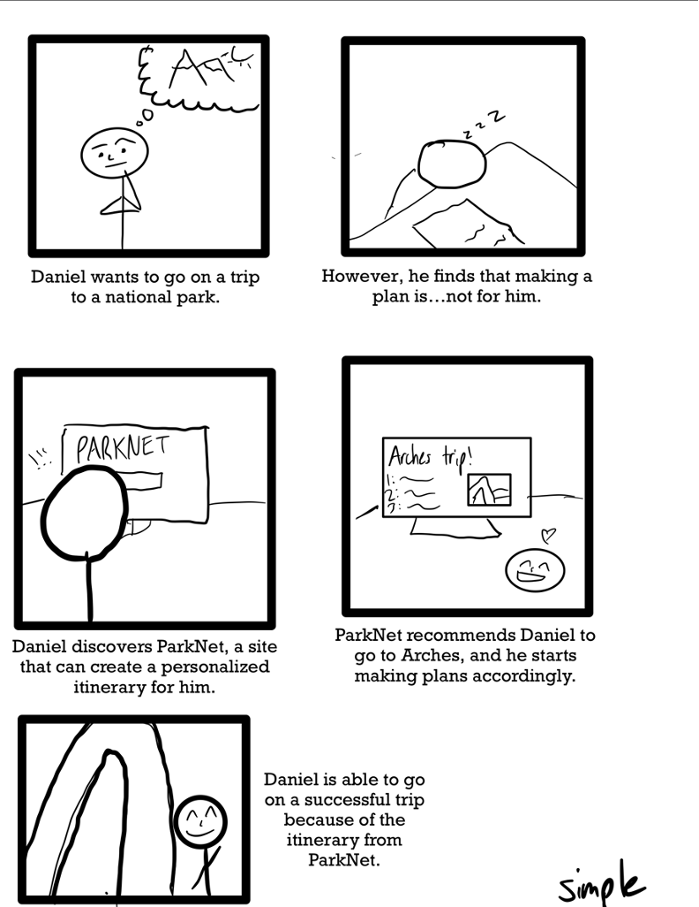
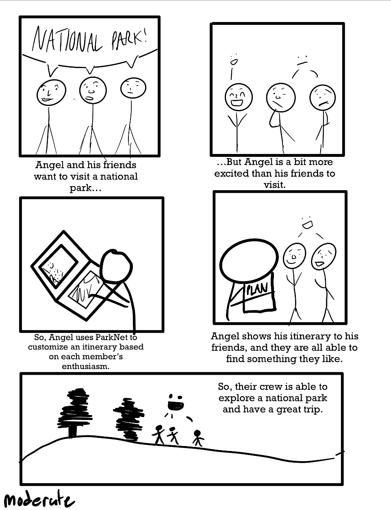
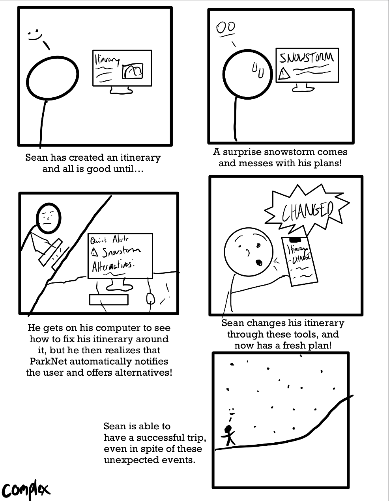

# parkNet
## National Park Explorer: Your Guide to the Great Outdoors

## Welcome to the National Park Explorer Project!

## About Our Project
National Park Explorer is a web-based platform designed to help outdoor enthusiasts and casual travelers alike discover and plan trips to national parks in the United States. Leveraging user-centric design and comprehensive research, our tool personalizes travel suggestions, itineraries, and prepares you for an unforgettable adventure.

## User Research Summary
The user research report for the ParkNet project delves into the preferences, challenges, and expectations of a diverse group of individuals regarding travel planning, with a special focus on national parks. This comprehensive study aims to refine ParkNet's personalized itinerary crafting solutions.

### Key Findings

#### Travel Preferences and Habits
Participants varied widely in their travel habits, ranging from urban explorations to nature excursions, with a marked preference for visiting national parks. Key considerations for travel included budget, companionship, and the quest for personalized experiences.

#### Challenges in Travel Planning
The study identified several common challenges:
- Difficulty adhering to strict itineraries
- Finding budget-friendly travel options
- Accessing up-to-date, detailed local information
- Balancing travel desires with environmental responsibilities

#### Expectations from Travel Planning Platforms
Desired platform features emerged as follows:
- Flexible planning capabilities
- Real-time information updates
- Educational content focused on conservation
- Customizable itineraries
- Use of user-generated content to uncover hidden travel gems

#### Inferences

- **Diverse Preferences:** A trend towards nature-oriented travel among participants suggests a need for resources catering to such interests.
- **Need for Personalization:** The demand for personalized travel experiences tailored to individual interests, budgets, and habits is evident.
- **Technology Integration:** Participants showed a keen interest in platforms that offer current information, detailed maps, itinerary customization, and insights into affordable travel and volunteering opportunities.

#### Point of View Statements

- Focusing on new national park explorers and those seeking itinerary flexibility without strict adherence to schedules.
- Offering personalized, budget-conscious trip options, and integrating educational content on conservation.

#### How Might We Statements

- Cater to a broader user base interested in national parks.
- Provide itinerary planning flexibility and comprehensive travel data integration.
- Highlight affordable travel opportunities and include real-time updates and detailed planning information.

### Needs

Outlined needs include:
- Engaging content for newcomers to national parks.
- Flexible itinerary planning tools.
- Effective navigation aids and personalized travel recommendations based on budget considerations.
- Platforms that promote sustainable travel practices and foster community interaction.

In summary, the research underscores the necessity for a travel planning solution like ParkNet that deeply understands and addresses the complex needs of travelers seeking natural park experiences. The findings underscore the importance of flexibility, personalization, sustainability, and community in developing a platform that aligns with contemporary traveler expectations.

**Key Insights:**
- **Personalization** is crucial. Users want recommendations tailored to their interests, such as photography spots or conservation activities.
- **Up-to-date information** on park conditions, crowd levels, and trails is highly valued.
- **Sustainability** and **conservation** are significant concerns, especially among younger users.
- Challenges include finding **affordable travel options** and **balancing exploration with environmental responsibility**.

### Storyboards
Our storyboards illustrate how National Park Explorer addresses users' needs through three levels of tasks:

1. **Personal Recommendations:**  

2. **Accommodate Multiple Members' Preference:**  

3. **Quick Updates & Alternate Planning:**  

These scenarios showcase the flexibility and depth of our platform, catering to diverse user interests from adventure and photography to conservation and education.

---

Join us on this journey to explore, learn, and protect the wonders of America's national parks. Follow our progress on GitHub and be part of the National Park Explorer community!

**Links to our Mid-Fi Prototype:**  
Links for FIGMA

File link: https://www.figma.com/file/oNaaxsFSEinmCI9s8PNs30/Home?type=design&node-id=0%3A1&mode=design&t=VOVILSfL12lzS4fZ-1
 
Figma preview: https://www.figma.com/proto/oNaaxsFSEinmCI9s8PNs30/Home?type=design&node-id=1-2&t=VOVILSfL12lzS4fZ-0&scaling=min-zoom&page-id=0%3A1 

Let's discover the great outdoors together!

---

*This project is a work in progress, and we're excited to see where it will take us. Your support and feedback are invaluable as we continue to develop National Park Explorer. Thank you for visiting our GitHub page!*
